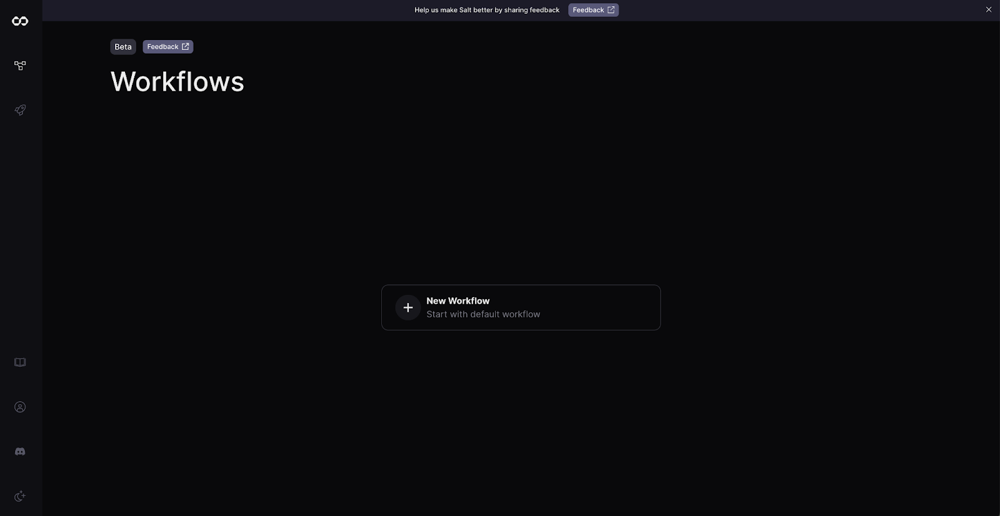

# Getting Started

# **Getting Started**

Create your Salt account by selecting “Get started” in the top right hand corner of the homepage. You can choose to authenticate using your Google or Github account. 

Once you’re logged in, you’ll be directed to the Workflows page.

Click “New Workflow” to start exploring the Workflow Editor.

Want to learn more about Workflows on Salt? Visit our Workflows help page.
