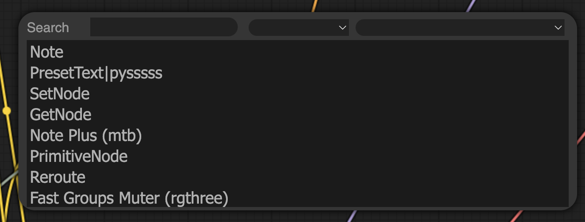
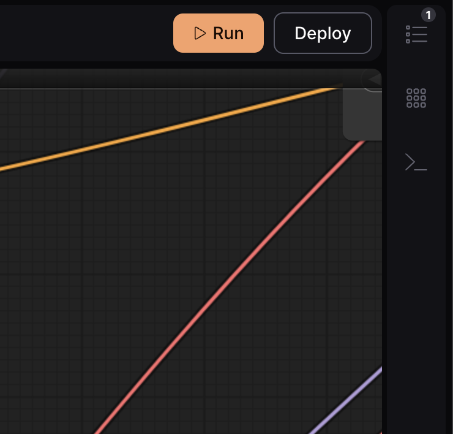
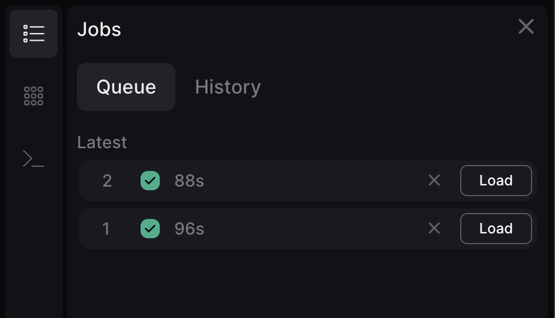
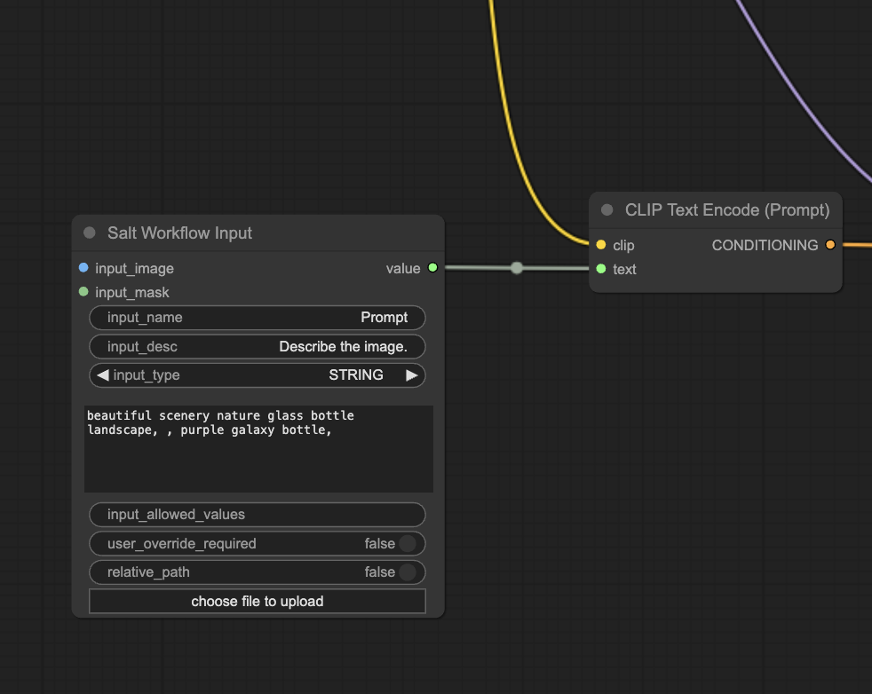
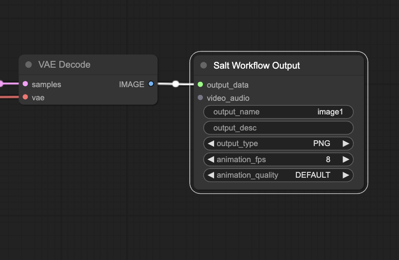

# Workflows

# Workflows

## Creating workflows

To create a new workflow, select “New Workflow” in the center of the default Workflows page, give your workflow a name, and select “Next”. A default sample workflow will automatically load. 

You can quickly delete nodes by holding down CTRL CMD A to select all, then delete to clear the canvas. Double click anywhere on the canvas or right click and select “Add Node” to add nodes to your workflow.

## Working with Salt’s input and output nodes

Salt requires the use of special input and output nodes in every workflow. The **[SaltInput node](https://docs.getsalt.ai/md/SaltAI/Nodes/SaltInput/)** is required for passing an input into a workflow. The **[SaltOutput node](https://docs.getsalt.ai/md/SaltAI/Nodes/SaltOutput/)** is required in order to render an output (i.e. for all workflows).

More on working with SaltInput and SaltOutput nodes in the video below.

[https://drive.google.com/file/d/1CXSp4sypP9J0rbMztFE84VSg6Z8gq_-E/view?usp=drive_link](https://drive.google.com/file/d/1CXSp4sypP9J0rbMztFE84VSg6Z8gq_-E/view?usp=drive_link)

## Importing an existing workflow

To import an existing workflow to Salt, drag and drop it onto the page or press Command + V with the JSON copied to your clipboard.

## Running your workflow

Once you’re ready to run your workflow, click “Run” in the top right corner. Your workflow will be added to the queue. 

You can track the status of your run in the status bar that appears in the top left corner, or by expanding the Jobs tab (seen below with a “1” badge).

To see your output, select the gallery icon to expand the Outputs tab. You can choose to download the JSON file for your output, download the output itself, open the image full screen in your browser and share a link, or delete it.

Identify any errors in your workflow by opening the Error logs, which appear at the bottom of your screen when expanded.

## Saving your workflow

Workflows automatically save as you go. You can find, open, and edit all of your workflows in the main Workflows page.

## Preparing your workflow for deployment

You can see a workflow’s inputs and outputs at the bottom of the screen. These count the number of SaltInput & SaltOutput nodes, which are the parameters exposed to the user when they run your deployed workflow through our API (currently the Salt Discord integration).

Use a SaltInput node for every parameter you want to expose to users who will be able to run your workflow, such as text inputs, seed number inputs, or an uploaded image or file.

You can use these in place of LoadImage nodes, or text boxes.

<aside>
💡 It’s a good idea to give your SaltInput nodes a unique name and description to help guide users of your workflow to know what that particular node should be used for (i.e. text prompt, uploaded image, etc.)

</aside>

You can plug a SaltInput node in place of a text box or node parameter by right-clicking the node and converting it to an input.

Your outputs can be configured using SaltOutput nodes, which is where you are able to specify your file types & frame rate. Each node can handle batch outputs, and you can have multiple nodes with different file types. It can help to name your outputs to differentiate them.

## **Need help?**

This guide is based on the beta version of Salt. Should you run into any issues or have questions, get in touch with our team via the [#support](https://discord.com/channels/1151592612525002822/1212167911771217961) channel in our Discord.
