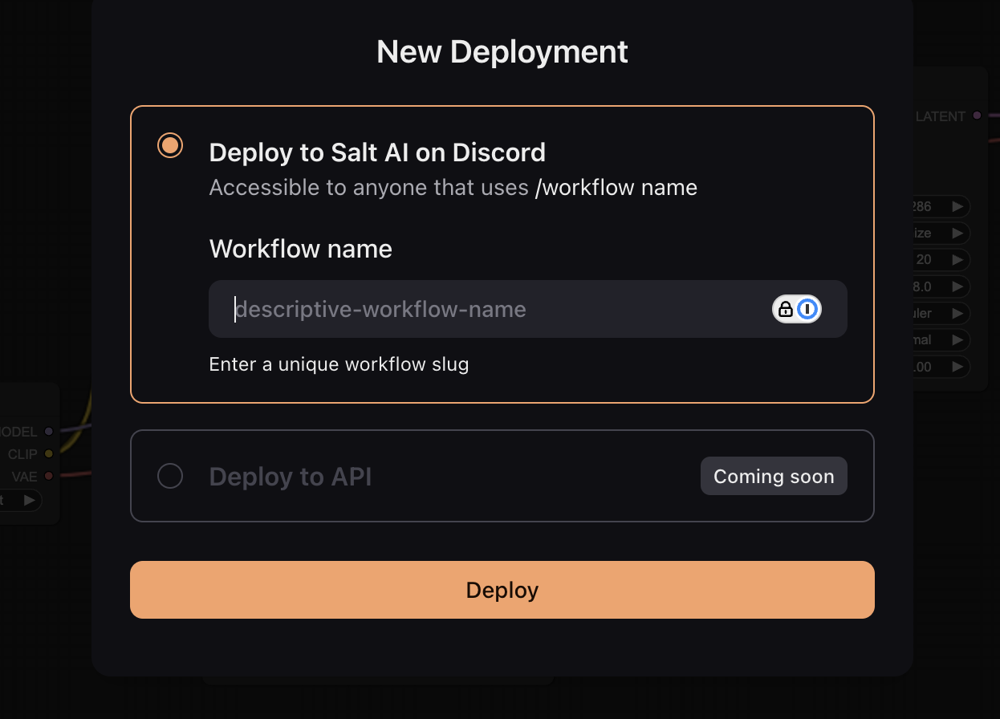

# Deploying Workflows via Salt API

## Overview

The `Deploy to API` feature in Salt AI allows you to transform your workflows into production-ready APIs, enabling seamless integration of advanced AI capabilities into your applications.

Key benefits:

- **Scalability:** Your deployment can handle increasing loads without compromising performance.
- **Accessibility:** Simplify the complex process of deploying an AI workflow with a single click.
- **Speed:** Lightning-fast deployments enable rapid iteration of workflows.

## Deploying to API

1. Ensure your workflow is [ready for production use](https://docs.getsalt.ai/workflows/#preparing-your-workflow-for-deployment).
2. In the workflow editor, locate and click the `Deploy` button.
3. Select the `Deploy to API` option.
4. You'll receive a unique endpoint for executing your workflow via API calls.



> **Note:** The most recent job execution must be successful to proceed with deployment.

## Making API Requests

### Example cURL Request

```bash
curl -X POST https://salt-api-dev.getsalt.ai/api/v1/deployments/7824a62e-8222-454d-9ef4-bf1c7746fed4/executions/ \
-H "Content-Type: application/json" \
-d '{
  "callback": "https://your-callback-url.com",
  "workflow_input": {
    "input_name": {
      "value": "My text input",
      "value_type": "RAW"
    },
    "input_name2": {
      "value": {
        "url": "https://imageurl.com/my-image.png"
      },
      "value_type": "REFERENCE"
    }
  }
}'
```

### Request Body Structure

```json
{
  "callback": "<CALLBACK URL>",
  "workflow_input": {
    "<input_name>": {
      "value": "<input_value>",
      "value_type": "<RAW|REFERENCE|ASSET>"
    },
    ...
  }
}
```

### Response to API Request

Upon successful submission, you'll receive a response containing the execution ID:

```json
{
  "execution_id": "d919a4b6-01cc-4e1a-ad7a-c59a066576b8"
}
```

## Understanding the SaltInput Node

The `SaltInput` node is crucial for exposing input parameters in your workflow. Each `SaltInput` node corresponds to an input property in the `workflow_input` object of your API request.

> **Best Practice:** Assign unique names to each `SaltInput` node for easier reference in your API requests. Unnamed nodes will use their node ID (e.g., "14") as the input name.

### Supported Value Types

1. `RAW`: For basic data types (Strings, Integers, Floats, Booleans)
2. `REFERENCE`: For URL inputs
3. `ASSET`: For Base64-encoded image or video data

## Receiving Results via Webhook

Due to varying execution times, Salt AI delivers results asynchronously through a webhook. Provide a callback URL in your request to receive the final results.

### Example Webhook Response

```json
{
  "output_name": ["https://storage.googleapis.com/...."],
  "execution_id": "d919a4b6-01cc-4e1a-ad7a-c59a066576b8"
}
```

## Troubleshooting

### Common Errors

1. **Invalid Input Structure:** Occurs when the request body doesn't match the expected format.
2. **Missing Callback URL:** Ensure you provide a valid callback URL for receiving results.
3. **Deployment Not Found:** Check that you're using the correct deployment ID in your API endpoint.

### Example Error Response

```json
{
  "error": "Invalid input structure",
  "details": "Missing required field 'workflow_input'"
}
```

## Best Practices

1. **Input Validation:** Implement thorough input validation in your workflow to handle unexpected inputs gracefully.
2. **Error Handling:** Design your workflow to handle potential errors and provide meaningful error messages.
3. **Versioning:** Consider implementing versioning for your deployed APIs to manage changes over time.
4. **Monitoring:** Use Salt AI's monitoring tools to track the performance and usage of your deployed workflows.

By following this guide, you can effectively deploy your Salt AI workflows as scalable, production-ready APIs. For further assistance or advanced use cases, please refer to our additional documentation or contact our support team.
