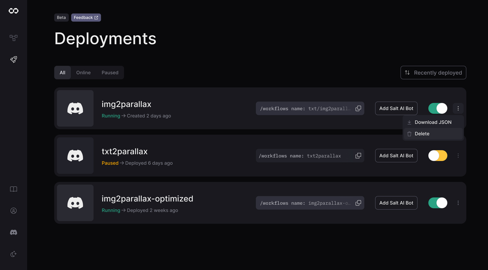

# Managing Deployments in Salt AI

## Overview

The [Deployments](https://app.getsalt.ai/deployments) page allows you to view, manage, and monitor your deployed workflows. This centralized dashboard provides an overview of all your deployments, their current status, and options to control them.

## Understanding Deployments

Deployments in Salt AI represent a snapshot of a workflow at a specific point in time. It's important to understand the following key concepts:

1. **Snapshot Nature**: When you deploy a workflow, you're creating a static snapshot of that workflow as it exists at that moment.

2. **Independence from Source**: Once deployed, a deployment is independent of the original workflow in the editor. Changes made to the workflow after deployment will not affect the existing deployment.

3. **Redeployment Process**: To update a deployment with changes made to a workflow, you must create a new deployment. This involves deleting the existing deployment and redeploying the updated workflow.

4. **Versioning**: Each deployment represents a distinct version of your workflow. This allows you to maintain different versions of your workflow in production simultaneously if needed.

## Understanding the Deployments Dashboard

The Deployments page displays a list of all your deployments, each represented by a card containing key information:

- **Deployment Name**: The name of your deployed workflow.
- **Status**: Current state of the deployment (Running, Paused, etc.).
- **Deployment Type**: Indicated by an icon (e.g., Discord icon for Discord bots).
- **Creation/Deployment Date**: When the workflow was deployed or created.

## Deployment States

- **Running**: The deployment is active and processing requests.
- **Paused**: The deployment is temporarily inactive but can be resumed.

## Managing Individual Deployments

Each deployment card offers several management options:

1. **Toggle Switch**: Quickly pause or resume a deployment.
2. **More Options** (three-dot menu):
   - **Download JSON**: Retrieve the deployment configuration.
   - **Delete**: Permanently remove the deployment. This is necessary if you want to redeploy an updated version of the workflow.

## Updating Deployments

To update a deployment with changes made to a workflow:

1. Delete the existing deployment for the workflow you want to update.
2. Go to the workflow editor and make sure your changes are saved.
3. Deploy the updated workflow, creating a new deployment.

This process ensures that your deployment always reflects a specific version of your workflow, maintaining consistency and allowing for easy rollbacks if needed.

## Filtering Deployments

Use the filter options at the top of the page to view specific types of deployments:

- **All**: Display all deployments.
- **Online**: Show only active deployments.
- **Paused**: Display paused deployments.

## Best Practices

1. **Version Control**: Keep track of which version of your workflow each deployment represents.
2. **Regular Updates**: Periodically review and update your deployments to ensure they reflect the most current version of your workflows.
3. **Testing Before Redeployment**: Always test changes in your workflow before deleting an existing deployment and redeploying.
4. **Documentation**: Maintain clear documentation of your deployment history, including reasons for updates and version differences.

## Troubleshooting

If you encounter issues with a deployment:

1. Check the deployment's status to ensure it's running.
2. Verify that the deployment represents the version of the workflow you intend to use.
3. If needed, delete the current deployment and redeploy the workflow to ensure you're using the most up-to-date version.
4. For Discord bot deployments, verify the bot's permissions in your Discord server.

<aside> ℹ️ Remember, changes made to workflows after deployment will not affect existing deployments. To incorporate workflow changes, you must create a new deployment.</aside>

For more detailed information on creating specific types of deployments, please refer to our [API Deployment](/deploy-to-api) and [Discord Bot Deployment](/deploy-to-discord) guides.
