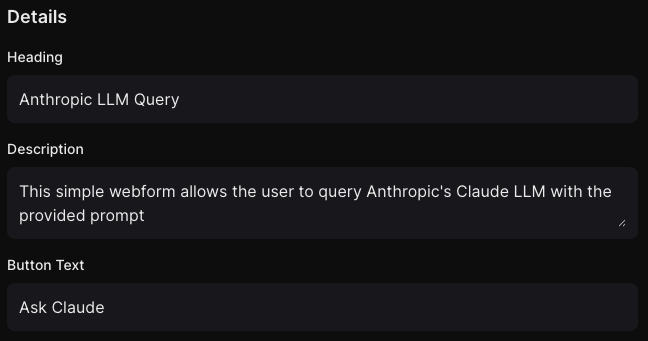

# Deployments: Webform

## Overview

The `Deploy to Webform` feature in Salt AI allows you to transform your workflows into easy to use webforms that can be shared and used by anyone.

Key benefits:

- **Scalability:** Your deployment can handle increasing loads without compromising performance.
- **Accessibility:** Simplify the complex process of deploying an AI workflow with a single click.
- **Speed:** Lightning-fast deployments enable rapid iteration of workflows.

## Deploying to Webform

1. Ensure your workflow is ready for use and your most recent run was successful.
2. In the workflow editor, locate and click the `Deploy` button in the header and select `Deploy to Webform`, or click the rocket-ship icon on the right-side panel. This will open the deployments tab in the right-side panel.
3. Select the `Webform` option at the top of the deployments tab (if it's not already selected).
4. Change the webform, input, and output settings as desired.
5. Click the `Deploy` button to create the new Webform deployment.
6. You'll receive a unique URL for accessing the webform which you can share with others.

## Configuration

### General Settings

The "Details" section of the deployment configuration allows you to configure the following:

- **Heading**: The title to be displayed at the top of the webform page.
- **Description**: A description to be displayed below the heading.
- **Button Text**: The text to be displayed on the submit button.

### Input Settings

The "Input" section of the deployment configuration allows you to configure input field settings for the webform. Each Input node in the workflow will be available to be configured and can have the following configured:

- **Visibility**: Whether the input field is shown to the user at all. If hidden; other settings will be unavailable and the input value from the workflow will be used.
- **Label**: The label to be displayed above the input field.
- **Default**: The default value to be displayed in the input field, which can be blank.
- **Required**: Whether the input field is required to be set to some value to submit the form.

### Output Settings

The "Output" section of the deployment configuration allows you to configure output settings for the webform. Each Output node in the workflow will be available to be configured and can have the following configured:

- **Visibility**: Whether the output field is shown to the user at all. If hidden; other settings will be unavailable.
- **Label**: The label to be displayed above the output field.

## Using the Webform

### Get the Webform URL

Once deployed, the webform will be available at the unique URL can copy from the deployments tab in the right-side panel. Navigate to the URL to view the webform.

### Run the Workflow

When you navigate to the webform URL, you will see the webform displayed as a simple form with the input fields and a submit button. Submitting the form will trigger the workflow to run and display the results in the outputs section (after some loading time, which may take a while for larger workflows).

