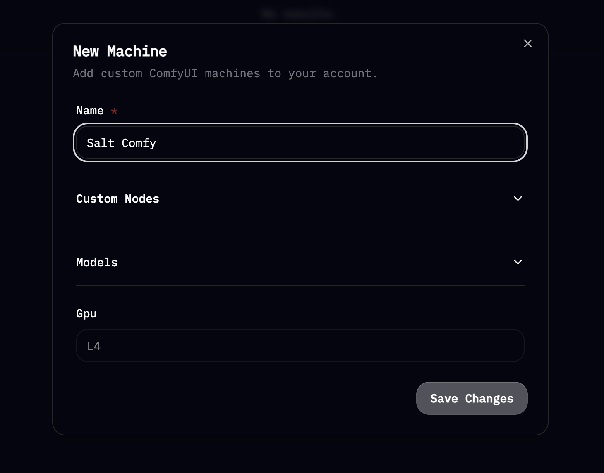
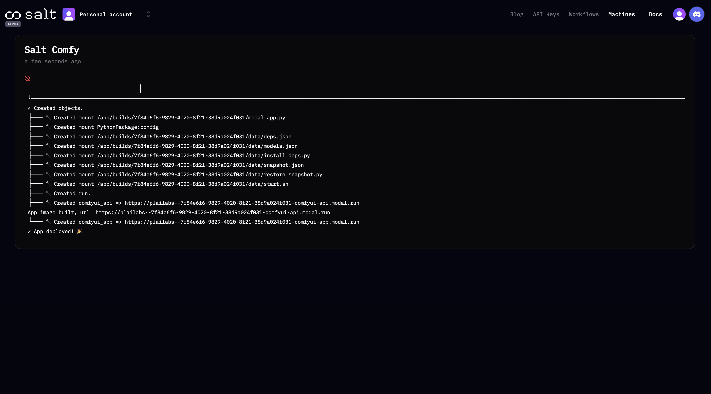
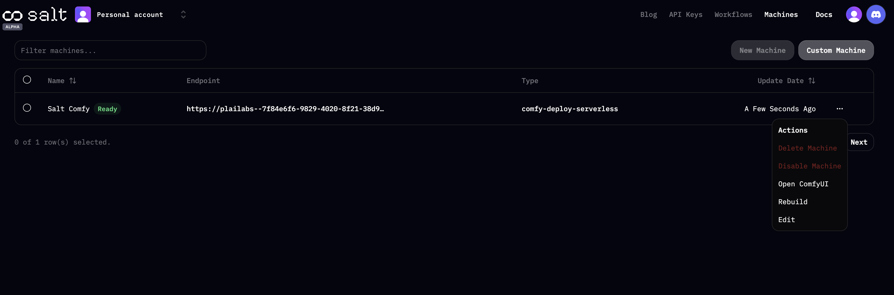
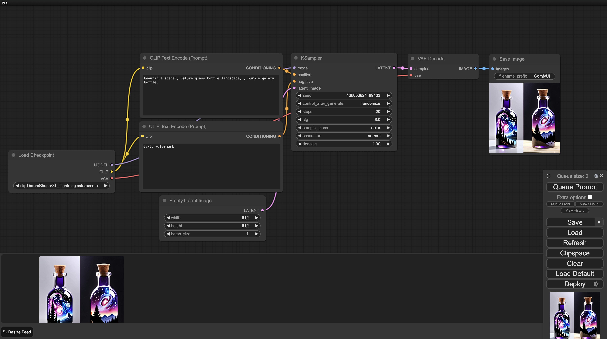
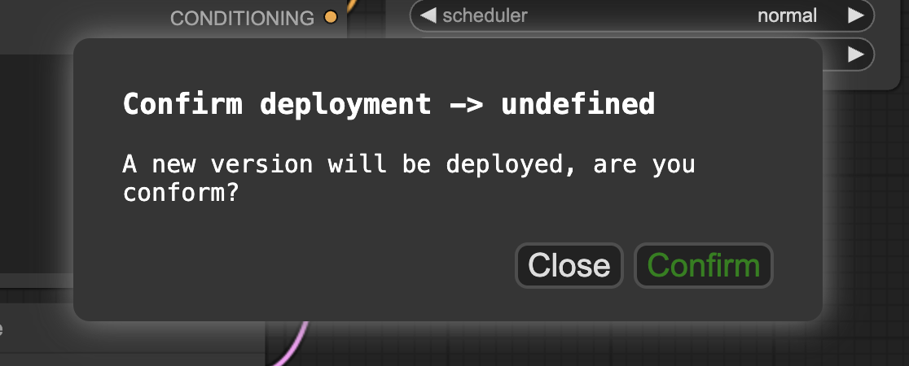
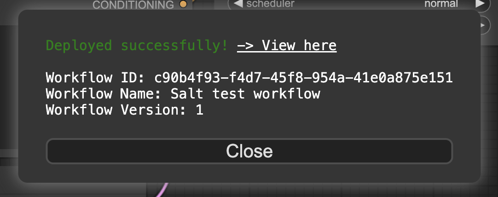
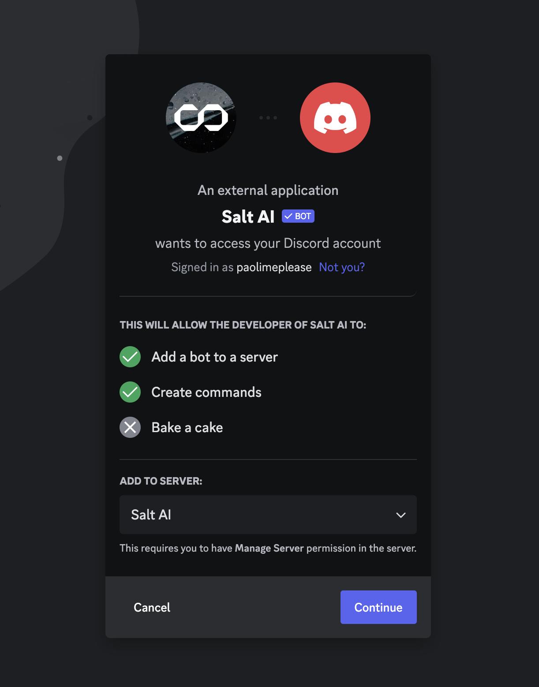

# Welcome to Salt Docs

## How to deploy your ComfyUI Workflow to Discord in minutes with Salt

<iframe width="560" height="315" src="https://www.youtube.com/embed/0IntF6SkwJc?si=si51CZixlNhHZYxa" title="YouTube video player" frameborder="0" allow="accelerometer; autoplay; clipboard-write; encrypted-media; gyroscope; picture-in-picture; web-share" allowfullscreen></iframe>

# How to deploy your ComfyUI workflow to Discord with Salt

This guide walks you through deploying your ComfyUI workflow to Discord using Salt, enabling you to run and share it in any Discord server. Please note that the Salt platform is in early alpha, so you may encounter bugs, and certain operations like loading times could be slower than expected. You can share feedback and get help in our Discord server here: [https://discord.gg/saltai](https://discord.gg/saltai)

## Initial Setup

### Logging Into Salt

- First, head to https://getsalt.ai and sign in or create your account.
- After logging in, click on the “Machines” tab in the top navigation bar.

### Creating Your Machine

- You’ll notice there are no machines listed initially. To create a new one, click “New Machine”.
- Name your machine (for instance, “Salt Comfy”), then click save. A brief deployment process will follow.

### Accessing ComfyUI

- Once your machine is set up, return to the “Machines” tab, click the three dots next to your machine, and select “Open Comfy UI”.

- It might take a few moments to load. Even if it appears unresponsive, it is still processing.

## Preparing your workflow in ComfyUI

### Editing Workflow

- ComfyUI will load with a default workflow interface. Before deployment to Discord, you need to add or adjust nodes to fit the inputs and outputs desired for your Discord workflow.

### Configuring Inputs and Outputs

- **Inputs**: If you want users of your workflow to be able to modify prompts, you need to incorporate the “Salt Flow Input” node into your workflow. This configuration can also be done locally prior to deployment.
- **Outputs**: Make sure your workflow includes a “Salt Flow Output” node that defines the type of response (e.g., GIF, PNG, MP4, string) your Discord bot will return.
- To add these nodes, right click to Add Node, then select “Salt” from the dropdown —> IO —> Salt Flow Input and Salt Flow Output

## Deploying Your Workflow

### Uploading and Deploying

1. Once you’re ready to deploy, click “Deploy” in the bottom right modal, name your workflow, and use the “Login with Salt” function to give Salt access to your workflow. Then click “Deploy” again.
    
    

    
2. Assign your workflow a unique identifier, confirm the deployment, and then you can view, edit, and copy its JSON for API integration.
    
    

    
3. Once your workflow has been deployed successfully in ComfyUI, click “View here” to see it in the “Workflows” tab of Salt.
    
    

### Discord Deployment Submission

- Your workflow requires manual approval by the Salt team before it becomes accessible through the Salt Discord bot. Once approved, it’s ready for use.

## Executing Your Workflow on Discord

### Adding the Salt bot

1. [**Click here**](https://discord.com/oauth2/authorize?client_id=1113909066587185274&scope=bot&permissions=2147605568) to add the Salt bot to any server where you have the required permissions
    
    

### Running Workflows

1. In any Discord with the Salt bot added, use the `/workflows` command and hit enter to open up the bot modal. 
2. Select “Browse Workflows”, then “New Workflows” —> “Select a recent workflow”. Find your workflow and click “Play” to enter your prompt and run. Based on the type of workflow, you can use text or image to generate your output. 
    
    

    

    1. You can also choose “Set default” to make your workflow the default option when others in the server use the /workflows or /play commands.

### Showcasing your workflows in the Salt catalog

1. To share your workflow with the Salt team and others in the community, first [**join the Salt Discord**](https://discord.gg/saltai) and complete onboarding.
2. Then, head to the [**#flow-catalog**](https://discord.gg/FcbmPDf3E7) channel and follow the example template to share your workflow. Be sure to run it using the Salt bot in a comment below and pin the comment, so others can easily grab and run it themselves.

<aside>
💡 Note: Your workflow can handle a variety of inputs and outputs for
comprehensive customization. You can expose 5 inputs and 1 output.

</aside>

## Need Help?

- This guide is based on the early alpha version of Salt. Should you run into any issues or have questions, get in touch with our team via the #support channel in Discord!